## Проект UI автотестов demoqa.com

<!-- Технологии -->

### Используемые технологии

  <code></code>
  <code></code>
  <code></code>
  <code></code>
  <code></code>
  <code></code>
  <code></code>
  <code></code>
  <code></code>
  <code></code>
  <code></code>
  <code></code>
  <code></code>

<!-- Тест кейсы -->

### Что проверяют UI тесты
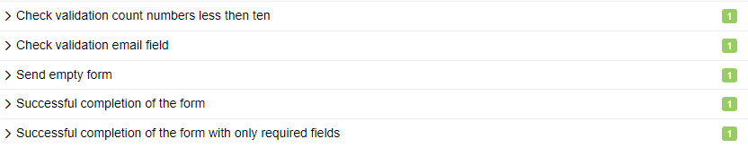

### Особенности тестов:

1. Тест test_submitting_form_successfully - данный тест параметризирован на запуск браузера на разных разрешений экрана (1920x1080 и 1280x720)
2. Тесты test_validation_field_email и test_send_empty_form - это примеры тестов созданных с использованием Page Module

### Демонстрация тестов для работы с файлами
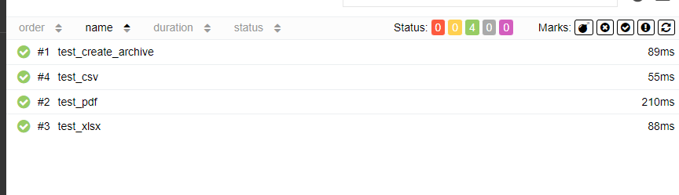
Первый тест создает архив из 3 файлов с расширением: pdf, csv, xlsx. 
Остальные три читают файлы внутри архива и проверяют содержимое файлов:
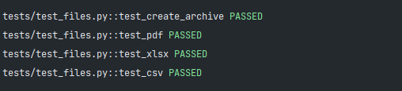
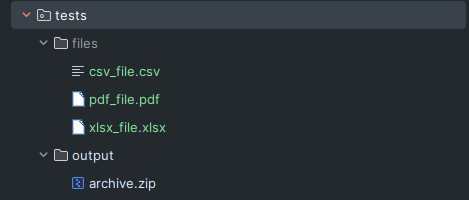

<!-- Jenkins -->

###  Запуск проекта в Jenkins

### [Job](https://jenkins.autotests.cloud/job/kudaev-demo-qa/)

##### При нажатии на "Собрать сейчас" начнется сборка тестов и их прохождение, через виртуальную машину при помощи Selenoid.
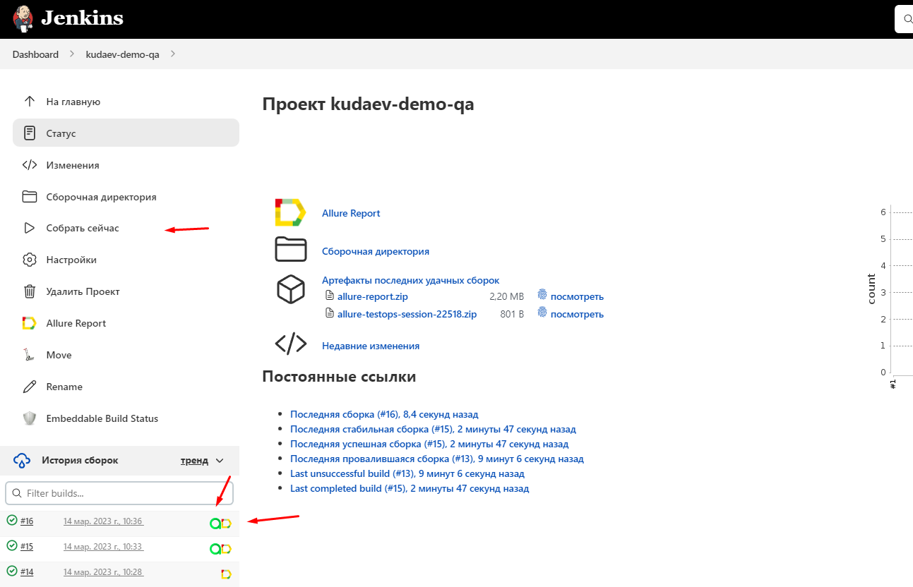

Также мы можем посмотреть выполнение тестов в консоли перейдя во вкладку "Вывод консоли" у определенного билда
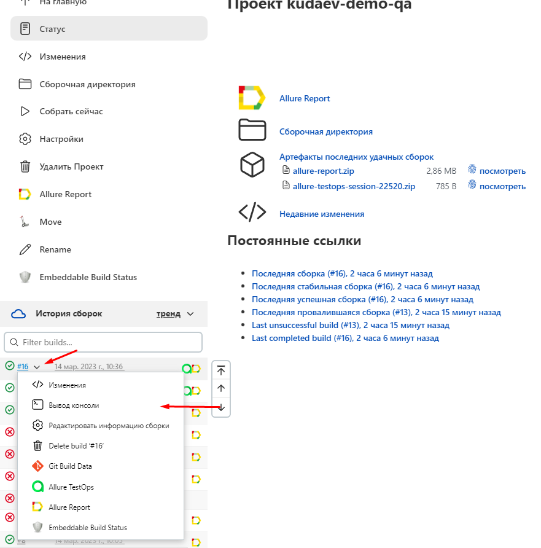

<!-- Allure report -->

###  Allure report

##### После прохождения тестов, результаты автоматически сохраняются. Чтобы посмотреть Allure отчет нужно нажать на иконке allure report у сборки.
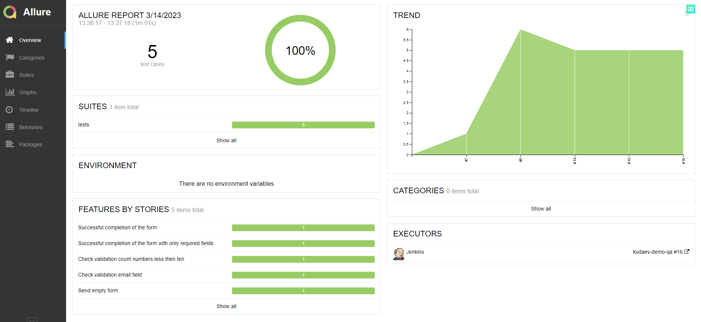

##### Во вкладке Graphs можно посмотреть графики о прохождении тестов, по их приоритезации, по времени прохождения и др.
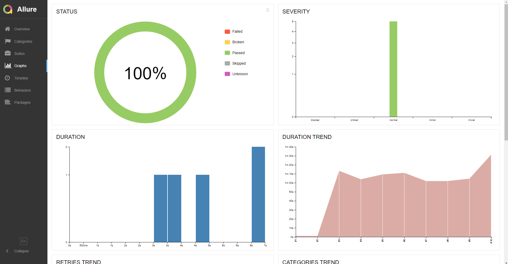

##### Во вкладке Suites находятся собранные тест кейсы, у которых описаны шаги и приложены логи, скриншот и видео о прохождении теста
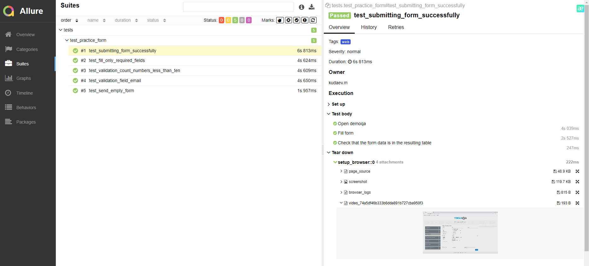

##### Видео прохождение теста
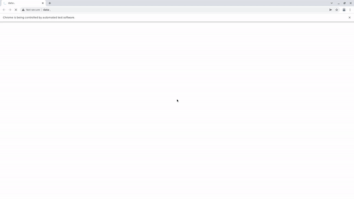

<!-- Allure TestOps -->

###  Интеграция с Allure TestOps

### [Dashboard](https://allure.autotests.cloud/project/2021/dashboards)

##### Вся отчетность сохраняется в Allure TestOps, где строятся аналогичные графики и тестовые кейсы.
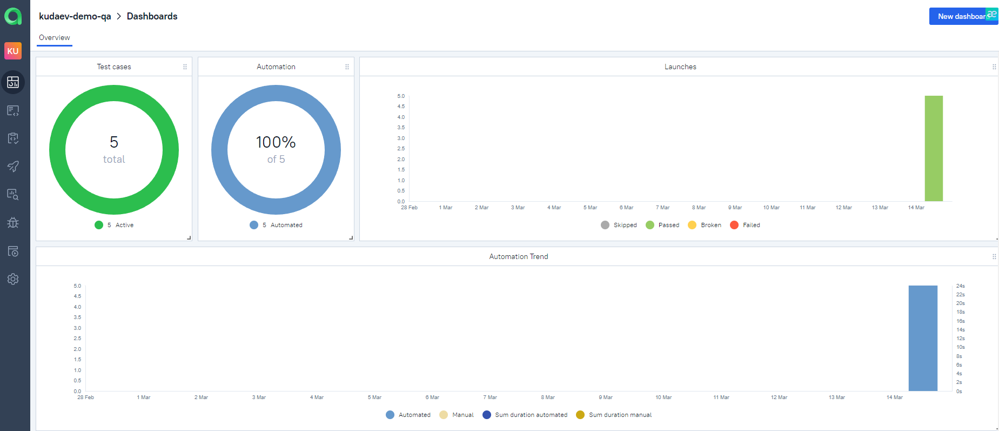

#### Во вкладке со сьютами, мы можем:
- Управлять всеми тест-кейсами или с каждым отдельно
- Перезапускать каждый тест отдельно от всех тестов
- Настроить интеграцию с Jira
- Добавлять ручные тесты и т.д

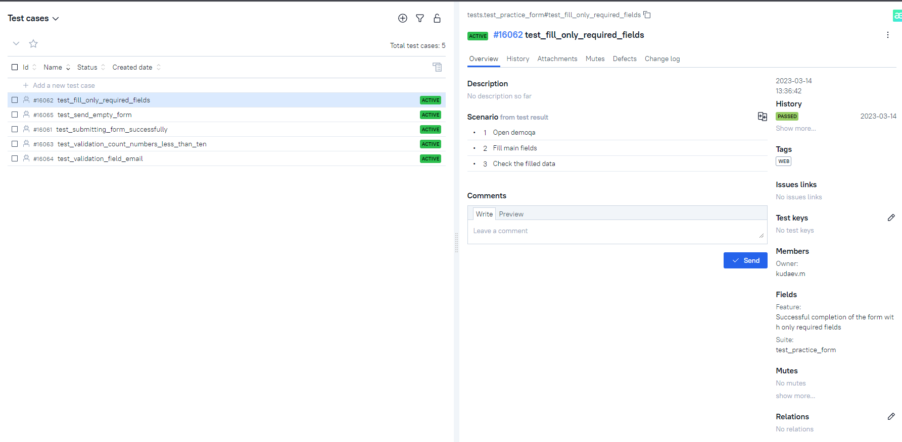

Во вкладке Launches мы можем видить тестовые прогоны:
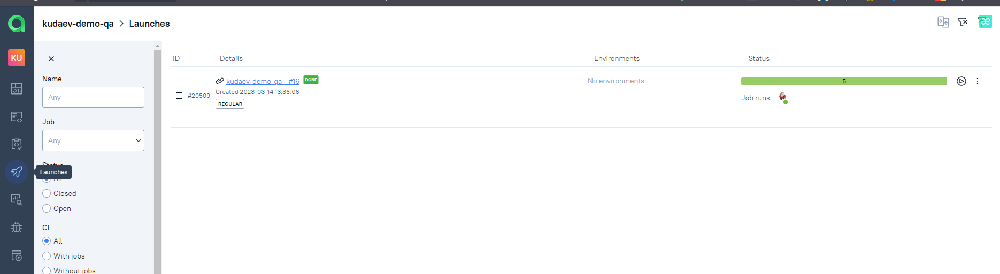

<!-- Jira -->

###  Интеграция с Jira
##### С помощью Allure TestOps можно сделать интеграцию с Jira, в тикет можно добавить результат прохождение тестов и список тест-кейсов.

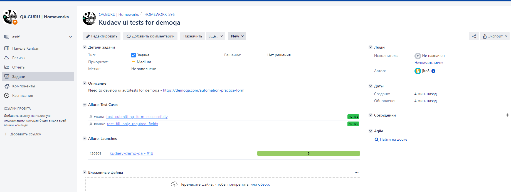

<!-- Telegram -->

###  Интеграция с Telegram
##### После прохождения тестов, в Telegram bot приходит сообщение с графиком и небольшой информацией о тестах, а также ссылка на allure report.

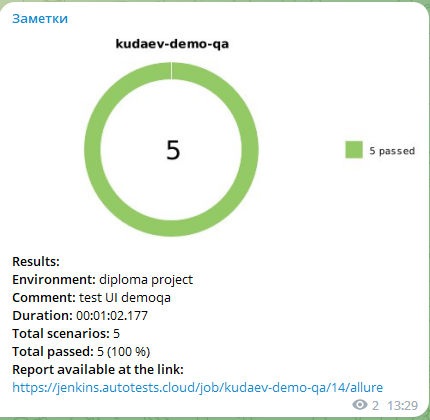
